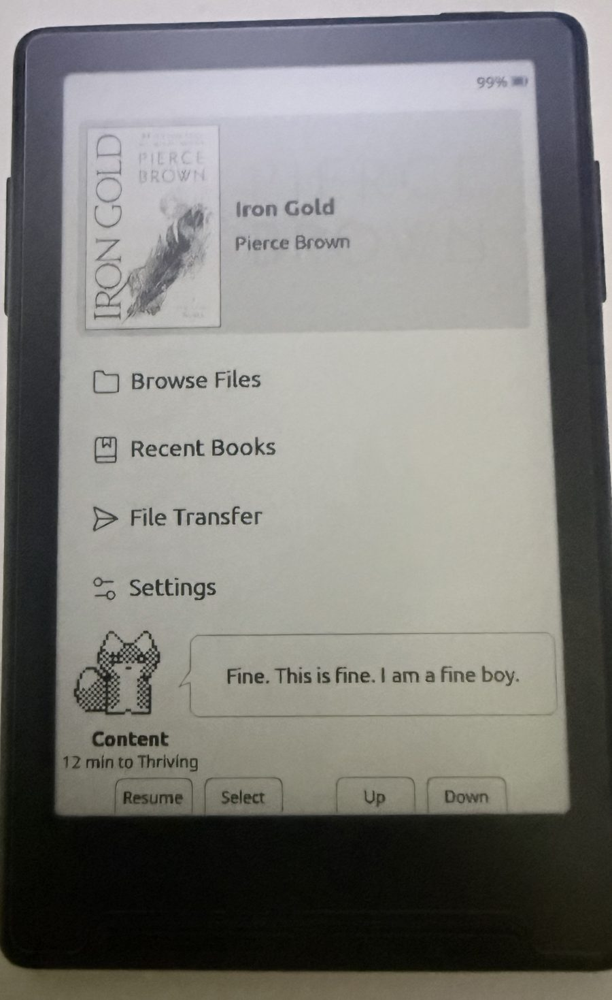

# CrossPoint Reader — Companion

A reading companion for [CrossPoint](https://github.com/crosspoint-reader/crosspoint-reader), the
open-source e-reader firmware. Pick a small pixel character; it lives on your home screen and its
mood depends on how much you actually read.


Everything CrossPoint already does is untouched. The companion is **off by default** and adds
around **16 KB of flash and 80 bytes of RAM** when you turn it on.

<!-- TODO: replace with a real photo of the home screen on your device -->
<!--  -->
> **📸 Photo goes here** — the home screen with a companion and its speech bubble.

---

## What it does

Read regularly and your companion thrives. Ignore it and it sulks, wilts, or powers down.

- **Five characters** to choose from, each with their own artwork and voice
- **Four moods**, driven by how much you read and how many days you skip
- **180 written lines** — the character comments on how you are doing, and the line changes
  every time you land on the home screen
- **It paces around** while you move the menu cursor, and turns to face the way it is walking
- **A streak counter**, and a nudge telling you how far you are from the top mood today

---

## The companions

Left to right in each strip: **Thriving · Content · Peckish · Neglected**.

### Sophocles — the fox
House Telemanus's sigil fox from *Red Rising*. Aristocratic, judgemental, and permanently
convinced you are hiding jellybeans.


> *"You smell faintly of jellybeans. Approved."*
> *"I have seen dead men read more than this."*

### Vellum — the ghost
A page-spirit that only stays solid while somebody is still reading. When neglected it literally
fades out — the same artwork drawn at a quarter density instead of a solid fill.


> *"I am not haunting you. I am supervising."*
> *"Bloody hell, I can see through my own hands."*

### Octavo — the robot
A page-counting unit that runs on finished chapters instead of batteries. Swears exclusively in
error codes.


> *"SIGNAL STRONG. READING QUOTA EXCEEDED."*
> *"FATAL: give a shit exception. Core dumped."*

### Lumen — the moth
A paper moth that navigates by the light of whatever you are reading. Wings spread when the
reading is good, shut tight when it is not.


> *"Drunk on lumens. Absolutely hammered."*
> *"I have started eating the curtains. Your fault."*

### Sprig — the sprout
A potted thing that grows a leaf per finished chapter. Passive-aggressive about drought.


> *"I am the best damn plant on this device."*
> *"I am ninety percent stick at this point."*

<!-- TODO: replace with a real photo showing a couple of different characters -->
> **📸 Photo goes here** — a different character on the device, for contrast.

---

## How moods work

| Mood | How you get there |
| --- | --- |
| **Thriving** | 25+ credited minutes today |
| **Content** | 2+ minutes today, **or** you read yesterday |
| **Peckish** | Exactly two quiet days — you skipped one full day |
| **Neglected** | Three or more quiet days |

Two details matter:

**"Credited" minutes are real reading.** Time only accrues while a page turned within the last
five minutes. A reader left open on one page earns nothing. Page-flipping without reading accrues
time but still has to clear a real threshold, so it will not jump you a tier.

**Days are your days.** The rollover uses your device's clock in your own timezone, so a
late-evening session does not land on tomorrow and break a streak. If the clock was never set,
day-based decay pauses instead of guessing, and the mood simply reflects the current session.

There is no death state. However long you neglect it, one good session brings it straight back.

<!-- TODO: replace with a real photo of a neglected companion -->
> **📸 Photo goes here** — a Peckish or Neglected companion, if you can bear to earn one.

---

## Install

### Easiest — no toolchain needed

1. Download `firmware.bin` from the [latest release](../../releases/latest)
2. Connect your device by USB-C and wake it
3. Go to [crosspointreader.com/#flash-tools](https://crosspointreader.com/#flash-tools)
4. Pick your device (**X3** or **X4**), choose **Custom .bin**, and upload the file

Your books, reading progress, and settings live on the SD card and are not touched by flashing.

### Command line

```bash
pip install esptool
esptool --chip esp32c3 --port /dev/cu.usbmodemXXXX --baud 921600 \
  write-flash 0x10000 firmware.bin
```

Find your port with `ls /dev/cu.*` on macOS or `dmesg | grep tty` on Linux.

### Back up first (recommended)

Flashing replaces the firmware. To be able to return to exactly what you have now — including
your Wi-Fi credentials and settings — save a full image first:

```bash
esptool --chip esp32c3 --port /dev/cu.usbmodemXXXX --baud 921600 \
  read-flash 0 0x1000000 crosspoint-backup.bin
```

Restore it with `write-flash 0 crosspoint-backup.bin`. You can also always reflash an official
build from the web flasher above.

> **Note on locked devices.** Some units bought from third-party sellers ship with USB flashing
> locked. If the browser's serial picker cannot see your device, check
> [CrossPoint's notes on the Xteink Unlocker](https://github.com/crosspoint-reader/crosspoint-reader#usb-locked-devices-xteink-unlocker)
> before going further.

---

## Turning it on

**Settings → Companion** to enable, then **Character** to choose who lives on your home screen.
**Show on Home** controls whether it is drawn.

Nothing changes about the reader until you enable it.

<!-- TODO: replace with a real photo of the settings screen -->
> **📸 Photo goes here** — the character picker.

---

## Building from source

```bash
git clone --recursive https://github.com/JoshuaMillerCode/crosspoint-reader-companion
cd crosspoint-reader-companion
pio run -e default            # build
pio run -e default -t upload  # build and flash
```

Needs [pioarduino](https://github.com/pioarduino/pioarduino) and Python 3.8+. The `--recursive`
matters: the FreeInk SDK is a submodule. If you forget it, run
`git submodule update --init --recursive`.

Host-side unit tests, no hardware required:

```bash
cmake -S test -B build/test && cmake --build build/test
ctest --test-dir build/test
```

---

## Making your own character

Each companion is a single plain-text file in [`src/companion/sprites/`](src/companion/sprites/)
holding both its artwork and its dialogue. No binary assets, no image editor.

```
name: Sophocles
kind: fox

[thriving]
..............##..........##......
.............#ww#........#ww#.....
...  30 rows of 34 characters  ...

[quotes.thriving]
Tail up. Very pleased with your page count.
You smell faintly of jellybeans. Approved.
```

| Character | Meaning |
| --- | --- |
| `.` | transparent |
| `#` | ink — outline, eyes, nose |
| `w` | paper — chest, muzzle, inner ears, tail tip |
| `o` | body fill, drawn as a 50% checkerboard |
| `d` | faded fill, drawn at 25% — used for ghosts and dead batteries |

Add a `.grid` file, list it in [`order.txt`](src/companion/sprites/order.txt), and rebuild. It
appears in the settings picker automatically. The build step packs the art into flash and will
**fail the build** with a `file:line` error if a row is the wrong width or a line is too long for
the speech bubble.

Because the panel is 1-bit, there is no colour: the dither densities are what give the artwork
its shading, and they are resolved at build time so the render path stays trivial.

---

## How it is built

- **Sprites** are 34×30 hand-placed pixels, packed 1 bit per pixel. All twenty poses total
  3,000 bytes.
- **Mood logic** lives in [`lib/Companion/`](lib/Companion/) as pure functions with no Arduino,
  FreeRTOS, or HAL dependencies, so the whole decay and crediting policy is covered by host unit
  tests before it reaches a device.
- **The walk cycle is driven by screen redraws, not a timer.** On e-ink a timer would keep the
  panel refreshing, block the low-power idle, and accumulate ghosting. Moving only when the screen
  was already repainting makes the animation free.
- **The speech bubble** is drawn with a midpoint-circle algorithm for its rounded corners and a
  half-plane test for the tail, since `GfxRenderer` has no rounded-rect primitive.
- **State** persists to `/.crosspoint/companion.json`, checkpointed mid-session so a flat battery
  does not discard an evening's reading.

---

## Scope

This is a fork, not a proposed upstream feature. CrossPoint's [SCOPE.md](SCOPE.md) explicitly
puts interactive extras out of scope for the core project, and that is the right call for a
firmware whose job is to disappear while you read. That is exactly what forks are for.

Everything else in this repository is CrossPoint, tracking upstream `develop`.

---

## Credits

- **[CrossPoint Reader](https://github.com/crosspoint-reader/crosspoint-reader)** — the firmware
  this builds on, and a genuinely pleasant codebase to work in
- **Sophocles** is inspired by House Telemanus's sigil fox from Pierce Brown's *Red Rising*
  series. No official artwork exists; this design is original. The other four characters are
  original creations
- Pixel technique follows [Derek Yu's tutorial](https://www.derekyu.com/makegames/pixelart.html)
  and standard [1-bit dithering practice](https://pixelparmesan.com/blog/dithering-for-pixel-artists)
- Companion mod by [@JoshuaMillerCode](https://github.com/JoshuaMillerCode)

MIT licensed, same as CrossPoint. See [LICENSE](LICENSE).

Not affiliated with Xteink, CrossPoint, or Pierce Brown.
