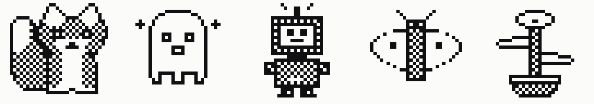
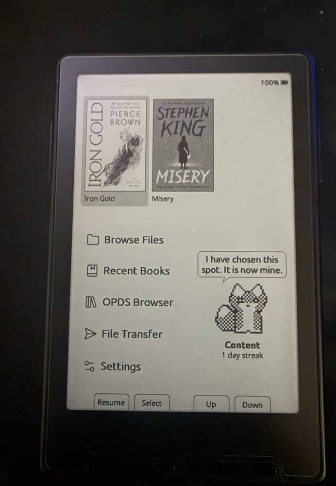
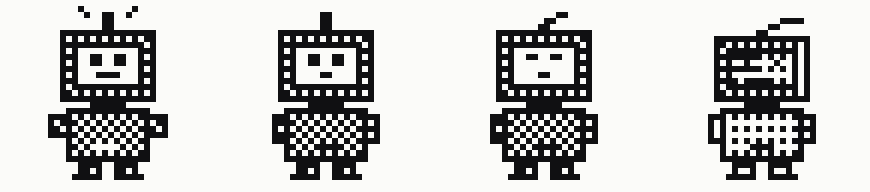
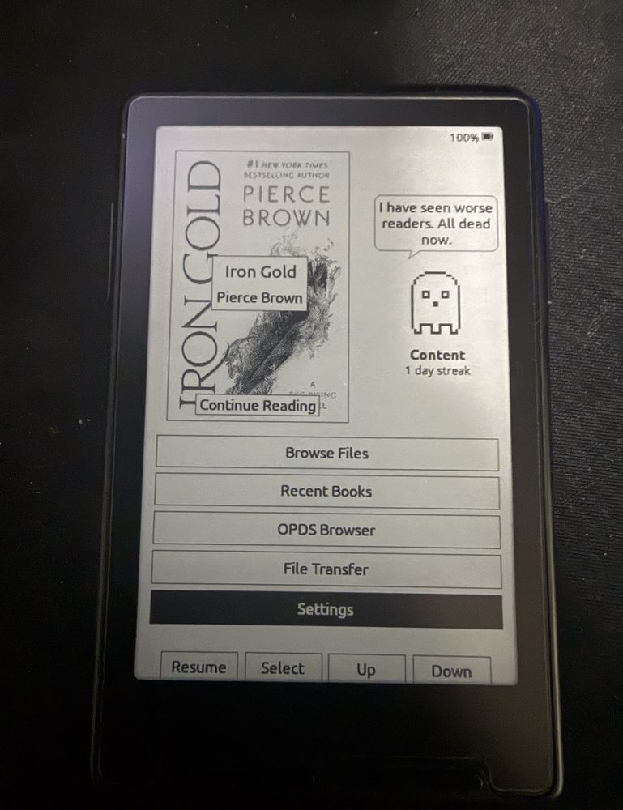

# CrossPoint Reader — Companion

A reading companion for [CrossPoint](https://github.com/crosspoint-reader/crosspoint-reader), the
open-source e-reader firmware. Pick a small pixel character; it lives on your home screen and its
mood depends on how much you actually read.



The companion is **off by default** and adds around **16 KB of flash and 80 bytes of RAM** when you
turn it on. Nothing about how CrossPoint reads, renders, or stores your books changes.

The one deliberate exception is a fix, not a feature: waking from sleep onto the home screen used
to leave the sleep image ghosted behind the UI, because the fast e-ink waveform paints over a
retained frame without clearing it. The first home paint after a wake now clears properly. It costs
roughly a second on wake and applies whether or not you enable the companion.

> ### ⚠️ Device support
>
> **Developed and tested only on the Xteink X3.** That is the only device this has actually run on.
>
> | Device | Status |
> | --- | --- |
> | **Xteink X3** | ✅ Developed and tested here |
> | **Xteink X4** | ⚠️ Untested. Should run — same chip, and the release binary includes it — but the X4 has **no RTC**, so streaks and day-based decay are unavailable (see below) |
> | **Xteink X4 Pro** | ❌ **Do not flash the release binary** — the X4 Pro is ESP32-**S3** and X3/X4 are ESP32-**C3**, so it will not boot. Needs its own `x4pro` build, which has **not been verified to compile** here (see [Building from source](#building-from-source)) |
> | Anything else | Untested |
>
> **Back up your current firmware before flashing.** Instructions are in
> [Install](#install) below. It takes two minutes and means you can always get back to exactly
> what you have now.

<p align="center">
  
</p>

<p align="center">
  <em>Sophocles on an Xteink X3, in the column beside the menu. The line is his own idea.</em>
</p>

---

## What it does

Read regularly and your companion thrives. Ignore it and it sulks, wilts, or powers down.

- **Five characters** to choose from, each with their own artwork and voice
- **Four moods**, driven by how much you read and how many days you skip
- **180 written lines** — the character comments on how you are doing, and the line changes
  every time you land on the home screen
- **It paces around** while you move the menu cursor, and turns to face the way it is walking
- **A streak counter**, and a nudge telling you how far you are from the top mood today

---

## The companions

Left to right in each strip: **Thriving · Content · Peckish · Neglected**.

### Sophocles — the fox
House Telemanus's sigil fox from *Red Rising*. Aristocratic, judgemental, and permanently
convinced you are hiding jellybeans.


> *"You smell faintly of jellybeans. Approved."*
> *"I have seen dead men read more than this."*

### Vellum — the ghost
A page-spirit that only stays solid while somebody is still reading. When neglected it literally
fades out — the same artwork drawn at a quarter density instead of a solid fill.


> *"I am not haunting you. I am supervising."*
> *"Bloody hell, I can see through my own hands."*

### Octavo — the robot
A page-counting unit that runs on finished chapters instead of batteries. Swears exclusively in
error codes.



> *"SIGNAL STRONG. READING QUOTA EXCEEDED."*
> *"FATAL: give a shit exception. Core dumped."*

### Lumen — the moth
A paper moth that navigates by the light of whatever you are reading. Wings spread when the
reading is good, shut tight when it is not.


> *"Drunk on lumens. Absolutely hammered."*
> *"I have started eating the curtains. Your fault."*

### Sprig — the sprout
A potted thing that grows a leaf per finished chapter. Passive-aggressive about drought.


> *"I am the best damn plant on this device."*
> *"I am ninety percent stick at this point."*

<p align="center">
  
</p>

<p align="center">
  <em>Vellum on the Classic theme. Different character, different theme, different corner of the
  screen: Classic's menu rows are full width, so the companion takes the space next to the cover
  instead. Switching character takes two button presses.</em>
</p>

---

## How moods work

| Mood | How you get there |
| --- | --- |
| **Thriving** | 25+ credited minutes today |
| **Content** | 2+ minutes today, **or** you read yesterday |
| **Peckish** | Exactly two quiet days — you skipped one full day |
| **Neglected** | Three or more quiet days |

Two details matter:

**"Credited" minutes are real reading.** Time only accrues while a page turned within the last
five minutes. A reader left open on one page earns nothing. Page-flipping without reading accrues
time but still has to clear a real threshold, so it will not jump you a tier.

**Days are your days.** The rollover uses your device's clock in your own timezone, so a
late-evening session does not land on tomorrow and break a streak.

There is no death state. However long you neglect it, one good session brings it straight back.

### Devices without a clock

Day counting needs a real-time clock. The **X3** and **X4 Pro** have one; the **X4 does not**.

Without a clock, elapsed days are genuinely unknowable, so rather than guess, day-based decay
switches off entirely: the mood reflects only the current reading session and never drops below
Content. In practice that means **no streaks, and no Peckish or Neglected** — you get Content and
Thriving.

The clock also needs setting once, over Wi-Fi, before day counting works. Until then the same
fallback applies.

<!-- A photo of a Peckish or Neglected companion would sit well here.
     Earning one takes three quiet days. See docs/companion/photos/README.md -->

---

## Install

The release binary is for **X3 and X4 only** (both ESP32-C3). **X4 Pro owners must build from
source** — a C3 binary will not boot on its S3 chip.

### Step 1 — back up your current firmware (please do this)

Flashing replaces the firmware on the device. A full backup lets you put back precisely the build
you are running today, rather than the nearest official release.

Your settings and saved networks are **not** what is at risk here — CrossPoint keeps those as JSON
files in `/.crosspoint/` on the SD card, and flashing does not touch the card. The backup is
insurance for the firmware itself.

```bash
pip install esptool
esptool --chip esp32c3 --port /dev/cu.usbmodemXXXX --baud 921600 \
  read-flash 0 0x1000000 crosspoint-backup.bin
```

Find your port with `ls /dev/cu.*` on macOS, or `dmesg | grep tty` on Linux. The file should come
out at exactly 16,777,216 bytes. Keep a copy somewhere other than the machine you flash from.

Restore any time with:

```bash
esptool --chip esp32c3 --port /dev/cu.usbmodemXXXX --baud 921600 \
  write-flash 0 crosspoint-backup.bin
```

If you skip the backup you can still recover — the web flasher below will put an official
CrossPoint build back on — but it will be whatever version that flasher offers, not necessarily
the exact build you had.

### Step 2 — flash

**No toolchain needed:**

1. Download `firmware.bin` from the [latest release](https://github.com/JoshuaMillerCode/crosspoint-reader-companion/releases/latest)
2. Connect your device by USB-C and wake it
3. Go to [crosspointreader.com/#flash-tools](https://crosspointreader.com/#flash-tools)
4. Pick your device (**X3** or **X4**), choose **Custom .bin**, and upload the file

**Or from a terminal:**

```bash
esptool --chip esp32c3 --port /dev/cu.usbmodemXXXX --baud 921600 \
  write-flash 0x10000 firmware.bin
```

Your books, reading progress, settings and saved Wi-Fi networks all live on the SD card — the
latter two under `/.crosspoint/` — and none of it is touched by flashing. This build is CrossPoint
1.5.0 with the companion added, so if you are already on 1.5.0 your existing `settings.json` is
read back unchanged: nothing to re-enter, nothing to set up again.

> ### ⚠️ Locked devices — do not flash this with the Unlocker
>
> Some units bought from third-party sellers (AliExpress and similar) ship with USB flashing
> locked from the factory. Units bought direct from xteink.com are not locked. If the browser's
> serial picker cannot see your device, try another port and browser first, then see
> [CrossPoint's notes on the Xteink Unlocker](https://github.com/crosspoint-reader/crosspoint-reader#usb-locked-devices-xteink-unlocker).
>
> **Do not put this firmware through the Xteink Unlocker.** The only firmwares that tool
> officially supports are CrossPoint and CrossInk. Flashing anything else on a locked device can
> **permanently brick it** or strand it on that firmware with no way back.
>
> The safe route is to unlock with official CrossPoint first, then install this build from inside
> CrossPoint using the SD-card firmware update in Settings. That path never touches USB, so the
> lock stops mattering.

---

## Turning it on

**Settings → Companion** to enable, then **Character** to choose who lives on your home screen.
**Show on Home** controls whether it is drawn.

Nothing changes about the reader until you enable it.

<!-- A photo of the character picker would sit well here.
     See docs/companion/photos/README.md -->

### Themes

All four CrossPoint themes are supported. Their home screens are laid out very
differently, so each one tells the companion what space it can spare and the companion
arranges itself to fit.

| Theme | Where the companion sits |
| --- | --- |
| **Lyra** | In the column beside the menu |
| **Lyra Extended** | In the column beside the menu |
| **RoundedRaff** | In the column beside the menu |
| **Classic** | Below the menu, or beside the book cover when a fifth menu row leaves no space underneath |

On the first three the menu rows are narrowed to fit their labels, which opens a column
tall enough for a full-size character with its speech bubble above it and its mood
underneath. Classic's rows are full-width boxes with nothing to sit beside, so it uses
the strip below the menu, and when an OPDS row pushes that strip out of usable space the
book cover slides left and the companion takes the room next to it.

If a theme still leaves too little room, the text gives way before the character does:
the streak line goes first, then the mood label. Nothing is ever drawn over the menu,
the cover, or the button hints.

--- | --- |
| **Lyra** | Below the menu. The roomiest layout: large character, speech bubble beside it, mood and streak underneath |
| **Lyra Extended** | Below the menu, with the mood and streak moved to the right so the character keeps its size |
| **Classic** | Below the menu, same side-by-side arrangement as Lyra Extended |
| **RoundedRaff** | **Beside** the menu. Its rows are only as wide as their labels and its cover tile is the tallest of any theme, so the column next to the menu is much larger than the strip below it. The bubble sits above the character there |

If a theme leaves too little room for all of it, the text gives way before the character does: the
streak line goes first, then the mood label. Nothing is ever drawn over the menu or the button hints.

---

## Building from source

```bash
git clone --recursive https://github.com/JoshuaMillerCode/crosspoint-reader-companion
cd crosspoint-reader-companion
pio run -e default            # build
pio run -e default -t upload  # build and flash
```

Pick the environment for your device:

| Device | Environment | Chip |
| --- | --- | --- |
| X3 / X4 | `default` or `gh_release` | ESP32-C3 |
| **X4 Pro** | **`x4pro`** | ESP32-**S3** |

```bash
pio run -e x4pro -t upload    # X4 Pro
```

The chip differs, so the binaries are not interchangeable.

**On the X4 Pro specifically:** the `x4pro` environment has not been built successfully here. The
attempt failed while ESP-IDF configured its S3 toolchain, before reaching any companion code, so
whether this compiles for S3 is simply unknown rather than known-broken. Nothing in the companion
is chip-specific — no assembly, no C3 registers, and all layout comes from runtime screen
dimensions — so there is reason to expect it works. But nobody has demonstrated it.

If you have an X4 Pro and get it building, please open an issue. That, and a photo, is all it
would take to move it into the tested column.

Needs [pioarduino](https://github.com/pioarduino/pioarduino) and Python 3.8+. The `--recursive`
matters: the FreeInk SDK is a submodule. If you forget it, run
`git submodule update --init --recursive`.

Host-side unit tests, no hardware required:

```bash
cmake -S test -B build/test && cmake --build build/test
ctest --test-dir build/test
```

---

## Making your own character

Each companion is a single plain-text file in [`src/companion/sprites/`](src/companion/sprites/)
holding both its artwork and its dialogue. No binary assets, no image editor.

```
name: Sophocles
kind: fox

[thriving]
..............##..........##......
.............#ww#........#ww#.....
...  30 rows of 34 characters  ...

[quotes.thriving]
Tail up. Very pleased with your page count.
You smell faintly of jellybeans. Approved.
```

| Character | Meaning |
| --- | --- |
| `.` | transparent |
| `#` | ink — outline, eyes, nose |
| `w` | paper — chest, muzzle, inner ears, tail tip |
| `o` | body fill, drawn as a 50% checkerboard |
| `d` | faded fill, drawn at 25% — used for ghosts and dead batteries |

Add a `.grid` file, list it in [`order.txt`](src/companion/sprites/order.txt), and rebuild. It
appears in the settings picker automatically. The build step packs the art into flash and will
**fail the build** with a `file:line` error if a row is the wrong width or a line is too long for
the speech bubble.

Because the panel is 1-bit, there is no colour: the dither densities are what give the artwork
its shading, and they are resolved at build time so the render path stays trivial.

---

## How it is built

- **Sprites** are 34×30 hand-placed pixels, packed 1 bit per pixel. All twenty poses total
  3,000 bytes.
- **Mood logic** lives in [`lib/Companion/`](lib/Companion/) as pure functions with no Arduino,
  FreeRTOS, or HAL dependencies, so the whole decay and crediting policy is covered by host unit
  tests before it reaches a device.
- **The walk cycle is driven by screen redraws, not a timer.** On e-ink a timer would keep the
  panel refreshing, block the low-power idle, and accumulate ghosting. Moving only when the screen
  was already repainting makes the animation free.
- **The speech bubble** is drawn with a midpoint-circle algorithm for its rounded corners and a
  half-plane test for the tail, since `GfxRenderer` has no rounded-rect primitive.
- **State** persists to `/.crosspoint/companion.json`, checkpointed mid-session so a flat battery
  does not discard an evening's reading.

---

## This is version 1 — tell me what is wrong with it

It works, it has been used on a real device, and it is also the first version of something that
was built in a few days. There will be rough edges I have not hit yet, and choices that seemed
sensible to me and will annoy you.

**Please open an issue.** Anything is fair game:

- **Bugs** — [report one](https://github.com/JoshuaMillerCode/crosspoint-reader-companion/issues/new?template=bug_report.yml).
  Reports from an **X4** or **X4 Pro** are especially valuable, since neither has ever run this
- **Ideas and requests** — [suggest one](https://github.com/JoshuaMillerCode/crosspoint-reader-companion/issues/new?template=feature_request.yml).
  New characters, better lines, different thresholds, a different place on screen
- **Lines that are not funny enough.** Genuinely. The writing is half of this, and it is easy to
  change — each character's dialogue is plain text sitting next to its artwork

Things I already know are unfinished: there is no stats screen, the status bar has no companion
glyph, and the milestone line for beating your best streak has never been seen by anyone because
it takes days of reading to earn. On themes other than English, a long menu label can widen
RoundedRaff's rows enough to squeeze the companion's column out.

**Already fixed since 1.0.0**, thanks to people who reported them:

- The companion only laid out correctly on Lyra. It now adapts to all four themes: Lyra, Lyra
  Extended and RoundedRaff give it the column beside their menu, and Classic moves it next to the
  book cover when a fifth menu row leaves no space below. Putting it beside the menu was a reader's
  suggestion and it is the best the companion has looked anywhere
- An OPDS server adds a fifth menu row, which used to push the companion off the bottom of the
  screen entirely on Classic and Lyra Extended
- Waking from sleep onto the home screen left the sleep image ghosted behind the UI until you
  pressed enough buttons to clear it. This one was a CrossPoint bug rather than a companion bug,
  and the fix costs about a second on wake in exchange for a clean screen

If you build a character of your own, please send a pull request. One text file is the whole
contribution.

## Scope

This is a fork, not a proposed upstream feature. CrossPoint's [SCOPE.md](SCOPE.md) explicitly
puts interactive extras out of scope for the core project, and that is the right call for a
firmware whose job is to disappear while you read. That is exactly what forks are for.

Everything else in this repository is CrossPoint, tracking upstream `develop`, apart from two
upstream bug fixes found while building this: the sleep-wake ghosting described above, and a
divide-by-zero in the settings list that made the character picker do nothing. Both belong
upstream rather than in a fork, and both are offered there.

---

## Credits

- **[CrossPoint Reader](https://github.com/crosspoint-reader/crosspoint-reader)** — the firmware
  this builds on, and a genuinely pleasant codebase to work in
- **Sophocles** is inspired by House Telemanus's sigil fox from Pierce Brown's *Red Rising*
  series. No official artwork exists; this design is original. The other four characters are
  original creations
- Pixel technique follows [Derek Yu's tutorial](https://www.derekyu.com/makegames/pixelart.html)
  and standard [1-bit dithering practice](https://pixelparmesan.com/blog/dithering-for-pixel-artists)
- Companion mod by [@JoshuaMillerCode](https://github.com/JoshuaMillerCode)

MIT licensed, same as CrossPoint. See [LICENSE](LICENSE).

Not affiliated with Xteink, CrossPoint, or Pierce Brown.
